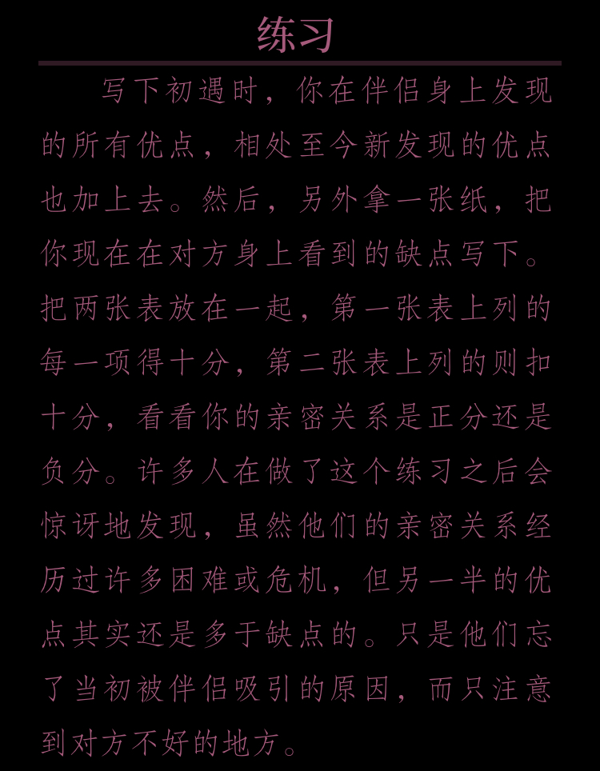

::: theorem

2. 开始和维持一段亲密关系背后的真正动机，其实在于需求。

【摘】恐惧是因为自身的安全感不足，却投射到了对方身上，对方的一举一动都会让自己患得患失。无知是因为没有认识到，原本就是两个不同的人，却用自己的标准去衡量对方。
你会发现，直到最近这几百年，才有许多人得到自己选择伴侣的自由。不过直至今日，世界上还有些地方的婚姻不是自由恋爱的产物，而是奉父母之命，原因不外乎社会地位、现实或经济等因素。
我们追求或吸引别人来做我们的伴侣，是因为我们需要人陪伴、照顾、了解、支持、接受、赞赏、抚摸和相拥而眠……
这是十分自然的，并没有什么不对。
但是若我们相信，我们所需要的快乐、安全感、自尊或其他的许多事物，都要经由别人来实现的话，这就成为一个大问题了。
假设你缺乏自信，那么你难道不会被一个自信满满的人所吸引吗？但对方又如何呢？他有可能被一个没自信的人所吸引吗？你会想，这当然不可能。因此，如果你希望那个人觉得你很特别，最好的办法就是，假装你也是一个充满自信的人。而对方为了吸引你，搞不好也在做同样的事！这种互动关系，通常就是两个人开始交往的原因，也就是一方误以为另一方拥有他所需要的东西。这并不是说我们故意欺骗想建立亲密关系的对象，但为了吸引别人，即使连我们自己都讨厌面具下隐藏着的需求，我们还是会尽力表现出最好的一面，以求达到目的。

3. 我们会想，这不只是为我们自己好，也是为他们好。这种修饰或彻底改造伴侣的企图，很快就会让我们走上通往地狱之路。

4. 如果我不能接受别人现在的样子，或不让他们自由地走自己的路，那么我就不是真的爱他们。我只是想从他们身上得到满足，与他们建立亲密关系的目的并不是为了爱，而是为了满足我小小的自私需求。

5. 如果你能不把自己的需求强加在伴侣身上，你就能在自己内心找到你真正需要的事物。摆脱了需求的束缚，你就能感受到纯粹的爱。然后，你能和情人分享的事情就更多了。另外，学着接纳你的伴侣（但并不是滥用忍耐力），也能让你学习到接纳本来的自我，而不再认为你需要些什么来让自己变得完整。学会放手和接纳之后，你一定会明白，你原本就是一个完整的个体，所需要的一切，都存在于你心中。

—————————————————————

6. 幻灭是灵魂给我的礼物，让我能从“向外寻求快乐”的错误思想中跳脱出来，快乐的源泉并不在别人身上。（先爱自己，才能正确的爱别人）

7. 我们宁愿争吵也不愿面对伤口，是因为生气比承受心碎要简单得多。所以一定要找到让彼此心碎的伤口来加以治愈，这样才可以让亲密关系维持下去。

8. 过去的创伤如果没有愈合，我们就会对自己产生负面的想法；但如果我们用健康的方式把伤痛处理好，我们的信念也会随之改变。

9. 只要找出解决痛苦的方法，我们就会发现自己其实是多么好的人，而让过去的创伤决定我们怎么看自己，又是一个多大的错误。

10. 有时候，我会发现只要把全副心思放在比痛苦更高层级的伟大事物上，我就有能力超脱身体和心灵的痛苦，同时也让自己充分感受痛苦的存在。

11. 在你找出自己真正的情绪需求之后，再问自己一个问题：“我愿不愿意放弃这项期望呢？”换句话说，我愿不愿意不再把满足这项需求当作伴侣的职责？我愿不愿意寻求自己内在的力量来满足我的所有需求呢？我愿不愿意让这种内在的力量成为我快乐的源泉，而不再把伴侣当成予取予求的对象？如果你的答案是肯定的，那么你的直觉会告诉你该如何放手。你该做的已经做了，剩下的就交给你的灵魂去处理。
    怎样才能知道你是不是真的放手了呢？看看你的伴侣就会明白。如果你感到爱在你们之间交流，你就知道你已做到了。如果你没有感到轻松，那么你可能还没有完全放手；或者，如果你真的已经放手了，却发现在第一个期望的背后，还有另一项更强的期望等着浮现，那么，不论你的情形是前者还是后者，都请再重复一次上述的练习。

12. 当放弃一项需求时，我们便把心中原本被需求占据的空间释放出来；而宇宙中是不容许有空洞存在的，所以我们心中的空间将会被爱所填满。

———————————————————

13. 四种主要的偏差行为：

    ——引起注意（看看我！看看我！）

    ——权力斗争（我不想做，你不能逼我！）

    ——报复心理（你伤害了我多少我也要伤害你多少。）

    ——自我放逐（努力有什么用呢？反正我一点也不重要。）

14. 没有一种吸引注意力的法子能够一直不被识破。你的伴侣早晚会厌烦，而且会感觉到这种行为背后的期望所带来的压力。毕竟，如果对方每天都看到同样的举动，很快他们就习以为常而不再注意了。当你发现自己不再被注意或赞赏，你会变得更加沮丧。很快你就会开始做出第二种偏差行为——权力斗争。

15. 伴侣的一些小怪癖，你以前觉得很可爱，现在却显得很恼人，而且常常成为争吵的主因。他奇大无比的笑声曾经是那么新奇有趣，现在却让你脊柱发麻。她说的故事曾经是那么扣人心弦，现在却让你无聊得想要尖叫。也就是说，在某种程度上，你们已经开始让彼此心烦。这个时候，你似乎只有以下几种选择：一、用蛮力或恐吓强迫伴侣改变生活习惯、说话方式、穿衣风格、头发长度等；二、学习圣人般的忍耐力；三、甩掉现任情人另觅新欢。大多数人，不管原因为何，都选择一，于是权力斗争就此展开。我们常常以为，权力斗争的方式不外乎大吵大闹、互砸东西或拳脚相向。但事实上，权力斗争可以有许多不同的面貌，包括冷战、避不见面、冷嘲热讽或单单是互给白眼。一对我认识的夫妻如果在吵架，我一进他们家门马上就会知道，因为整个房子静得像座教堂，而且带着恐怖片高潮的那种张力。

16. 但我必须记得一件事，那就是，当我想和妻子吵架时，原因往往不是出在她身上，而是来自过去未解决的伤痛。所以，如果我和妻子吵架，只会把事情弄得更糟。不直接面对旧伤，只会让自己过得更惨，而由于我坚持我的痛苦是妻子的错，也让她很不好过。我们不正视问题，却情愿为了一些鸡毛蒜皮的小事吵架，当被卷进权力斗争的旋涡时，你一定要切记：我生气的原因，不是我自己想的那回事。

17. 在我看来，让权力斗争更痛苦的原因是，争执的两方往往是真的关心对方。只不过痛苦实在太强烈了，让我们感受不到内心里渴望与对方分享的爱。只要找出解决痛苦的方法，我们就会发现自己其实是多么好的人，而让过去的创伤决定我们怎么看自己，又是一个多大的错误。

18. 旁观者可能觉得很容易，只要两个人稍微妥协一下就皆大欢喜了。但我发现有一个问题，妥协也有两面：其一，妥协并不能完全满足任何一方，因为两个人都觉得没有得到真正想要的。其二，更严重的是，问题真正的原因没有得到处理。事实是，约翰和玛莉不高兴的真正原因，并不是他们自己想的那样。想要了解真正的原因，我们就得看看约翰和玛莉有些什么样的生活经历。当他们相遇而恋爱时，约翰和玛莉都以为自己早就把过去抛诸脑后，但那天早上，两人都觉得自己再一次为了表达自身的重要性而受到伤害。他们都很痛苦，却不肯面对真正的问题，而只是选择一味地争吵。这种行为模式实在太普遍了，以至于大多数人都相信它是亲密关系的一部分，也就是说，事情一直都是如此，以后也不会改变。

    事情的真相是，约翰和玛莉都在试图控制对方的行为，借以控制过去的创伤。就像我小时候，情愿一直呆坐在硬邦邦的椅子上，也不愿意吃下恶心的胡萝卜罐头。许多夫妻也是如此，情愿忍受不愉快的权力斗争，也不愿面对争吵背后的痛苦。身为咨询顾问，我发现亲密关系中最大的问题便是我们面对痛苦的态度。每段亲密关系都会遇到困难，而每个问题的背后，都伴随着某种情绪的伤痛。就是这种伤痛，导致争吵、批评或互相指责。如果我们遇到困难却纵容自己任意发怒，这将会让两人的感情渐行渐远。也许一段时间之后，问题会消失，而我们又再次得到平静。但这样的平静，代价却是很大的，因为我们把伴侣拒于千里之外，深怕与他们亲近会造成更多痛苦。

    每次与妻子争吵而把她推开后，一旦怒气平息了，我总会有很糟糕的感觉。我会有罪恶感而且感到羞耻——因为恐惧，我把生命中最重要的人拒于千里之外，我牺牲了她来保护我自己。这有什么用呢？痛苦仍在我心中，有机会的话还会再次浮现。和心爱的人吵架并不能解决任何事，而只会让我们愈来愈不信任对方，也愈不信任我们的爱。我们原本应该让爱来疗伤并拉近彼此的距离，但我们却让怒气将彼此的距离拉大。试着把自己想象成一个高玻璃杯，里面装满了水。

    【转】没有完美的人，在亲密关系中也是一样，随着接触的增加，人们的缺点和不好的习惯或者说是不让人接受的行为逐渐暴露，相处开始出现障碍，正所谓相爱容易相处难，处在亲密关系中的两个人需要相互磨合，相互包容，不断自我反省与改正，双方才能做到真正的成长，关系才能更加长久。

19. 多年来我一直把亲密关系比喻成克林特·伊斯特伍德的一部有名的电影：《好的，不好的，和丑陋的》不过我会在最后面再加上一个“神圣的”。当你与伴侣初遇时，你们所分享的大多是“好的”。到了幻灭的阶段，你们便会开始发现所谓的对方“不好的”一面。在这个阶段快要结束，而内省的阶段即将开始时，事情多半会变得“丑陋”。如果你能用健康的态度来面对“不好的”和“丑陋的”，那么内省的阶段将会让你领悟到亲密关系事实上是多么“神圣”。然而，一开始的时候，我们对“不好的”往往会反应过度，而无法只是去“回应”它。要去了解、接受或宽恕，毕竟不是那么容易，相比较起来，发怒就简单得多。

20. 吵架时我们说的话和事情没有太大的关联，我们只是用言语来伤人，同时替自己的行为找个符合逻辑的借口而已。但是，言语攻击本身就是不合逻辑的，而只是用暴力来保护自己。所有攻击都是出于自卫。

21. 愤怒背后的主要意图也就是如此：让别人有罪恶感，让他们为你内心的痛苦负责。于是，让你快乐就成了他们的责任。从长远的眼光来看，你用何种方式表达愤怒，或别人用何种方式对你表达愤怒，根本就不重要。如果你感到愤怒，怒气其实是在保护你不去感受痛苦。如果我们能对自己诚实，并选择面对痛苦，我们就会了解这是治好旧痛的机会。而如果我们选择攻击伴侣或抽离自己的情绪，那么我们也许不必去感受痛苦，但同时我们也失去了疗伤的机会，自然也就无法改正这些痛苦所造成的自我局限的信念。最后，愤怒被广泛运用还有一个很重要的原因。当旧痛以争执的形式浮现时，愤怒提供给我们一个美妙的机会去感觉自己是“对的”。

22. 不过，如果你希望拥有健康、美好的亲密关系，你也许会考虑对自己的愤怒负责，充分地感受它，但不把怒气加在别人身上，这样你才能发现生气是为了逃避什么。如果你愿意面对自己所逃避的感觉——不论这令你多么不自在——你就能发掘埋藏在更深处的、平静而充满爱的感觉。我的亲身经历告诉我，不管多大的痛苦，只要集中全部精神来面对它，我就能有效地减轻痛苦，并让它转变成正面的感觉。要做到这样，必须有决心，我把这样的决心叫作“爱意”。

23. 当旧痛浮现并伪装成两人意见上的不一致时，我们潜意识的行为模式和信念，可能会让我们对伴侣口出恶言，然后生气地离开现场。相反，爱意则能让我们克制冲动，用负责任的态度来处理我们心中的不快，不致说出责怪或指责的话，而用理解、体谅的话来取代。这样我们便成长了。

24. 每当痛苦浮现，我会认为我唯一的选择就是挣脱并且受苦，要不然就是控制伴侣的行为，让我不再痛苦。现在的亲密关系给了我机会去察觉过去和现在的痛苦，面对它们并做出更高层级的选择，让我能够成长并了解真正的自己。这个机会，我相信就是“爱意”，而爱意是存在于所有权力斗争之中的。

—————————————

25. 事实上，你们双方都是从自己的角度去看事情，并坚持自己是对的。但如果你能够放下自己的立场，从对方的角度来看一看，那么你就可以把两人的意见综合起来而得到真相——这是一顶红蓝各半的帽子！

26. 以下这张图表（图一）列出了正反方各自的特征：
    
    一般来说，只要正反方能尊重彼此的看法，并接受彼此的意见，那么亲密关系中的两极其实可以合作无间。反方会发现问题，并把它提出来讨论，正方则会在聆听之后，想出解决的方法。然后，反方会挑出这个解决方案中的问题，正方则在修正后提出可行性更高的方案。两人会不断重复这些步骤，直到找出最佳的解决方案为止。在这过程中，你会发现反方变得愈来愈乐观，而正方也变得愈来愈实际。这样，亲密关系便取得了和谐的平衡。

    问题：（对比自己进行自省）我们并没有生气或争吵，但如果我们仔细检查，就会发现我们把对方推得远远的。正方推开伴侣的方式是否认自己的感觉，所以他们在外表上看起来仍然很愉快、很乐观，演技之好，甚至可以骗过他们自己。他们也许会表现得超然、冷漠，或充满了爱与关怀，但是他们并不是真的感觉到内心的爱和关怀，因为他们根本什么感觉都没有。反方推开伴侣的方式，则是专注在他们认为对亲密关系造成影响的问题上，并整天沉溺于这个问题所带来的情绪中——通常是愤怒、气恼或沮丧的情绪。通常反方所专注的问题，和伴侣的人格或行为并没有直接的关系。反方可能会提出家计问题、家里有什么东西需要修理、邻居的狗太吵，甚至是社会腐败之类的问题。简而言之，正方逃避痛苦的方式，就是否认问题的存在；而反方逃避的方式，则是专注在恼人的事情上，并将其夸大，借此分散自己的注意力。

27. 人类有一个倾向，就是对事情的反应往往过于急躁，所以人们很难了解其实所有的状况都是没有好坏之分的。妻子忘了去拿你的干洗衣物，不是好事，也不是坏事，不是做对，也不是做错。你的男友花太多时间在朋友身上，并不代表什么。状况本身并没有好坏，好坏是由你来决定的。状况是不是等于问题，要看你怎么去诠释它。你会有负面的看法，是因为过去的创痛影响了你。我提出了一个模式，如图二所示，来描述亲密关系的发展过程，当然前提是，这必须是一段健康、非病态的亲密关系：
    
28. 所以，如果你不喜欢现在亲密关系的状态，你只要放下立场，去寻求和谐就可以了。在一般情形下，你的伴侣也会跟着改变。如果你觉得对方没有改变，往往是因为你并没有放下自己的立场。有时候，虽然伴侣的行为没有改变，你却不再介意了。还有些时候，伴侣不肯改变，而选择离开。如果是这样，那么两人都可以重新寻觅更适合自己的亲密关系。只要你肯放下立场，不管结果是怎样，对你永远是只有好处没有坏处的，因为坚持立场所得到的，只有理直气壮和骄傲所带来的不真实的安全感。放了手，就能得到自由，让自己在智慧和成熟中成长。

29. 所有的权力斗争，一开始都巧妙地伪装成亲密关系所遇到的一个状况。图三这张表，也许能帮助你明白，这个状况虽然看似平静的池塘，但其实下面躲藏着大海怪。如果玛莉和约翰能为自己的旧痛负责，而不怪罪对方，将痛苦表达出来，使其浮上台面，借由这样的方式，他们其实可以选择爱他们自己。只要两人察觉到了痛苦的存在，就可以选择平静地去体验它，用爱来支持彼此，一起度过。要做到这样，最简单的方式就是沟通。 

30. （重要）沟通的基本法则：

我们来看看有效沟通的八个纲要问题：

1．我想要什么？

2．有没有什么误会要先澄清的？

3．我所表达的情绪，有哪些是绝对真实的？

4．我或我伴侣的情绪，是不是似曾相识？

5．这种情绪是怎么来的？

6．我该怎么回应这种情绪？

7．情绪背后有哪些感觉？

8．我能不能用爱来回应这种感觉？

当我诚实回答这些问题的时候，我的亲密关系问题就迎刃而解了。另外，我还发现，与亲密关系无关的问题，也能借由跟伴侣沟通的方式而得到解决。

在我的理论中，用负责的态度去面对自己感觉的意愿，是沟通的关键，也是解决权力斗争的方法。如果你是正方，你会避免去感觉，而如果你是反方，你则会认为自己早已经感觉到了。我要说的是，真正感受自己的感觉，并且决心安抚它们，能让你跟伴侣、朋友、亲戚或同事更加亲近。

关于有效沟通的基本法则：

第一，有些用过这些方法的人会说，一开始很有效，但时间长了就行不通了。既然这和我自身的经验相符，我便了解到，有时候冲突是一波“两”折的，偶尔也会一波“三”折。所以，你要让自己为第二波冲突做好准备，并且对沟通及感受的方法保持信心。只要听从自己内心真诚的意向，你一定能达到更高的境界。

以上的原则及纲要的目的是要开启我们的心房，让我们了解，每个冲突其实都可以有完美的解决方案。许多人只知道妥协，却不知道人与人之间的沟通事实上可以有更好的方式。我们从小就常听人说，人际关系就是“给予与获得”，但我的理论则是“给予与接受”。我不想从伴侣身上“获得”什么东西——这样我会觉得自己像个贼一样，我情愿“接受”伴侣自愿给我的东西。

【摘】这点真的很特别，从获得转为接受。“有时候，过于考虑对方只会让我们更加憎恶对方，”当我们将亲密关系之中的准则定义为“给予和获得”便容易用获得去对比自己的给予，进而产生不满意，甚至心生怨愤，成为杀死一段亲密关系的利剑。相反，如果我们把给予获得换成接受，在面对伴侣做出的一些小小的温暖感动的事都能让我们觉得惊喜和幸运，心中也会积累更多对这份关系的信念，从而进入到一个正向循环的状态里。

31. 当受到情绪及恐惧的影响时，我们会心生怀疑，不再确定自己是否能达到和谐解决问题的目标。这也就是为什么我们必须在试图沟通时，不断问自己一个重要的问题——事实上，这可能是世界上最重要的问题——“我想要什么？”当你深入了解人心时，你就会发现世界上发生的所有事，都是人的意愿所造成的。如果我们希望完善解决一个问题，让危机成为转机，并且决心达成这个目标，那么我们最后一定会发现真理——了解自己是谁，问题也自然迎刃而解。

    当然也有些时候，我没有足够的勇气，不愿去追寻真理，而情愿筑起心墙来确保自己的安全；或者我想证明自己是对的，而不愿做个快乐的人。如果是这样，那么我就牺牲了我所爱的人，把他们当作敌人来看待，离他们远远的，或者无情地攻击他们。如此一来我就无法得到和谐满意的结果，而是变得越来越自我、孤立。这些不愉快的结果并不是我的错误所造成的；错误是学习必经的过程。我心里想要的事物，才是造成不愉快的原因。

32. 【想法】如果无计可施，就选择臣服（向真理臣服，即我想要的是快乐与爱），发生重大问题时如果沟通得不到结果，一定时刻问自己我想要什么，我的爱人不是我的敌人，站在对方的立场，发现问题背后的真理，我们都在为对方着想，真正引起冲突的原因其实是我们自己内心深处的痛苦；找到痛苦，放下利益，由衷表达自己的爱意，但不是例行公事。

33. 我相信沟通的关键就是臣服。一旦你向真理臣服，你就能得到灵魂的引导。灵魂会让你知道该说些什么，并且领着你一步步走上和伴侣的融合之路。有时灵魂会让你察觉内心存在已久的深层痛苦；有时它会让你学会去爱、去欣赏，并且感激伴侣；有时它会让你学会不再用期望去束缚伴侣。不论何种方式，灵魂总会让你更靠近自己的内心，并了解到你和伴侣（还有世界上所有人）是一体的。

    对正经历幻灭阶段并深陷权力斗争或企图控制对方的人，我的忠告是认真学习有效沟通的原则，尽可能去了解它们。然后，在激烈的争执中，相信自己的心和灵魂，让它们引导你，只要你诚心地顺服，真理便会让你明白该怎么做。

    不管做什么事都是一样，只要知道自己真正要的是什么，你就会自然找到方法。如果知道做不到有效沟通会有什么后果，你也许会更愿意尽力去做。

34. 在亲密关系中，察觉报复的迹象并选择改变，是很重要的。思考一下你和别人发展亲密关系的原因，你就会了解，你的目的并不是要伤害任何人。争吵是谁“开的头”并不重要，因为这并不是任何人的错。会争吵是因为你内心的创痛需要治疗。如果痛苦浮现，你却选择让自己痛上加痛的话，那么你已经失去了方向，需要重新思考你在亲密关系中的目标。如果现在你面对痛苦的方式，还是和三岁的时候一样，那么你就无法成长。你将一辈子在自我防卫中度过，无法信任别人，而且各种微妙形式的报复，将会成为你生活的一部分。要记得，报复是一把双刃剑，施加报复的人和被报复的对象，受到的伤害是一样深的。而且，选择报复虽然很容易，却并不是阻力最少的途径。事实上，这是阻力最大的一条路。报复让你难以体验真爱。如果你选择报复，最后一定会走上自我放逐的死路。

    比较聪明的方法是，检查一下亲密关系中，你有没有在哪些地方去刻意（不管是自觉或不自觉的）伤害伴侣。晚回家又不打电话，跟尖酸批评或恶言相向一样算是报复的行为。你必须了解自己在报复时用了什么作为武器，并且让伴侣知道。问问对方哪些话或行为会让他/她真正受到伤害，然后保证以后会对自己的行为更加注意与负责。放下武器，选择和睦相处吧！

35. 想要在亲密关系中获益，我们必须以不同的心态来面对痛苦。记住下面这句话，或许会有些帮助：痛苦虽不能避免，要不要受苦却可以选择。

36. 亲密关系通关指南：

1．我们小时候所受的痛苦，大都由于需求不足。孩提时代两大主要需求是归属感和确认自己的重要性。有时需求没有得到满足所造成的痛苦非常深重，让我们觉得再这样下去自己好像会死掉，或受到重大的伤害。

2．为了保护自己免于心碎，我们会采取非常手段，也就是把没有满足我们需求的人（“伤害”我们的人）拒于千里之外。我们把痛苦丢进地下室——也就是潜意识里。但是有一个很大的问题，那就是我们对于当初对自己造成创伤的人、事、时、地，以及原因，往往存有错误的记忆。人类的心智似乎有自我保护的机制，让我们不会再一次感受过去的创痛。保护自己的两个方法是：麻醉自己和遗忘。我们把痛苦深埋在潜意识里，然后把发生过的事忘记。往往创伤愈深，我们“健忘”的倾向就愈严重。

3．不管我们受到多重的责打，身体所受的痛总是比不上心理的痛。感觉自己不被爱是最伤人的，这种感觉会让我们对自己产生负面的想法，让我们无法了解自己真正的潜力——开创快乐的、自我实现未来的潜力。

4．把生命中重要的人拒于千里之外，会让我们对每个人都保持距离。但我们还是会有需求，还是希望有人能满足我们，于是我们相信，想要得到满足，只能用强迫别人的方式，因而想出许多操纵别人行为的方法。这些操纵人的手段衍生自沮丧的心，而不是出自爱或灵性，所以这样的行为是被误导的偏差行为——即使我们如此做是为了得到爱。珍·尼尔森指出四种主要的偏差行为是：

引起注意（看看我！看看我！）

权力斗争（我不想做，你不能逼我！）

报复心理（你伤害了我多少我也要伤害你多少。）

自我放弃（努力有什么用呢？反正我一点也不重要。）

总有一天，我们会选择一个亲近的对象，这个人可能是密友、情人或伙伴；我们希望这样就能让存在已久的需求得到满足。我们会故技重演，采用小时候做出的偏差行为。随着年龄增长，偏差行为会变得复杂，但结果却是不变的：我们的需求还是没有得到满足，而曾经感受到的不被爱的伤痛又开始浮现。这样的互动，往往会让双方都产生错误的观感——两个人都认为对方的行为造成了自己的不快。妻子可能会经常忘记丈夫不喜欢她的某一种香水，而继续使用它；丈夫可能会把袜子和内裤到处乱丢，因而造成妻子的不便。两个人都认为对方的行为是造成自己痛苦的原因，于是争吵不休。他们都不了解，其实对方的行为只是让自己的旧痛浮现的催化剂。

5．当旧痛浮现，我们又会像从前一样，想把伴侣拒于千里之外。我们会展开权力斗争，使自己和对方保持距离。权力斗争在这时具有多重功能：我们企图控制对方的行为，因为我们认为那是造成我们痛苦的真正原因。
我们会采取跟对方相反的立场，让两人保持安全距离，这样一来，就不会感到痛苦。双方都觉得自己是对的，因而觉得握有力量。
分散双方的注意力，让两人都不必面对痛苦、沮丧的真正原因。

6．在所有的权力斗争中，其实在内心里，双方都感受到同样的痛。但两人采取了对立的立场，于是正方似乎对什么事都没有感觉，而反方则是对每件事都反应过度。两个人都不会感受到真正事关重大的痛苦，或是痛苦之下隐藏着的爱。

7．权力斗争一开始总是伪装得很好，看起来就像是人际关系中遇到的一个状况似的。但在这表面下，隐藏着什么呢？（请看图四）他们其实可以做出新的选择——只要他们能对自己的痛苦负责，不怪罪对方，表达自己的痛，让它浮上台面，他们就可以选择爱自己。痛苦一旦浮上了台面，两人就可以选择平静地去体验它，用爱来支持彼此，一起度过。要做到这样，最简单的方式就是和对方沟通。

8．能帮助你做出有效沟通的八个纲要问题如下：

① 我想要什么？

② 有没有什么误会要先澄清的？

③ 我所表达的情绪，有哪些是绝对真实的？

④ 我或我伴侣的情绪，是不是似曾相识？

⑤ 这种情绪是怎么来的？

⑥ 我该怎么回应这种情绪？

⑦ 情绪背后有哪些感觉？

⑧ 我能不能用爱来回应这种感觉？

以下所列的是九项我最喜欢的处理痛苦情绪的方式，我曾用这些方式得到了平静，也解决了问题。

方式一：向感觉吸入空气

找出你身体哪些部位与你的情绪相对应。通常愤怒的感觉会在颈背、下巴和肩膀造成反应；悲伤的感觉在胸腔和喉咙，或有时在眼睛后方造成反应；恐惧的感觉反应，则往往在消化器官。但这只是一般性原则，对情绪有反应的身体部位会因人而异。
一旦你找到了感觉情绪的身体部位，就把你的呼吸导向那个部位。你的吸气必须深到足够充满你的身体。吸气要均匀、不间断，不是吸气或呼气之后就停下来。不断向感觉吸进空气，并接受自己的感觉。如果排斥自己的感觉，你只会让它的负面影响更加壮大，而对你的身心造成更大的伤害。如果你能平静地向感觉吸入空气，只要一分钟，你就会发现感觉已经开始改变了。如此集中精神，呼吸六分钟以后，你的感觉就会完全不一样了。有时不一定是六分钟，需要多久才能完成这个过程，你就呼吸多久。

方式二：如实如是地接受

将觉知即刻带到感觉里。在此过程中，你的感觉中会有意识出现。之所以有意识的出现，是因为我们往往倾向于排斥和否定那些我们不想面对的情况，正是对这些不想面对的情况的拒绝，会导致我们在情感上对这些情况的排斥。但切不可把接受与顺从混为一谈。顺从是以容忍的方式掩盖拒绝的真相。“它就是这样子的”是一种强有力的表示方式，能够让你集中精力关注你内在的不适感。你也可以试着接受你排斥的东西，这会让你与自己的愤怒情绪相连接，更好地探索愤怒之下的感受。

方式三：触摸疼痛

如果没有意识到自己的感觉，你可以直观地问问自己：如果别人面临和你一样的状况，他们会有什么感觉，在他们身体的哪个部位会有反应（情绪几乎总是在躯干上造成反应，但有时头部也会有反应）。将你的手放在那个部位，去注意任何身体上的感受，逐渐地你就会意识到更深层次的感觉。一直把手放在那个部位，直到你完成整个过程为止，或者直到你意识到在身体的其他部位有更强烈的感觉为止。

方式四：克里希那穆提的方法

想象你的身体是一个容器。让你的痛苦充满整个容器，想象你的身体可以一直扩张，直到把所有痛苦都装进去为止。然后，让你心中的爱，散发出温暖的治疗之光。在体验感觉或情绪的同时，看着你的心，用无私、无条件的爱去照耀你的痛苦。用开放的心去接受这样做的结果。

方式五：运用肢体表达

依照你的感觉来移动自己的身体。大部分负面的感觉或情绪都是收缩性的，所以你可能会自然地想把身体缩成一团。让身体来表达你的感觉。当你觉得身体已经正确地表达出你的感觉时，你就维持住这个姿势，时间长短由你自己决定。然后，再想象你被快乐笼罩时，身体会做出怎样的动作。想象你另有一个快乐的身体在你的痛苦的、蜷缩起来的身体旁边绕着圈，然后慢慢靠近，最后和痛苦的身体合一。当两者融合的时候，会发生什么事呢？让你的身体来表达其结果。

方式六：笔者的方法

这个方法是我在二十岁出头的时候，无意间发现的。有一天我感到非常绝望，几乎到了无法承受的地步。我躺上床，闭上了眼睛，突然我发现自己可以“看到”痛苦呈现出来的形态——它是一团紫黑色的云。我全神贯注地望着它，发觉我的专注能让我到达云的中心。云的中心呈现不同的颜色——它是红色的。于是我专注地看着这片红色的区域，直到我所能“看到”的范围全部充满了红色的能量。现在我发现绝望的感觉已经消失了，取而代之的是由无助所导致的虚弱感。我的专注再一次带我到达这个感觉的中心，这次我看到的颜色是蓝色的。很快，我就被蓝色的能量包围住，而让我察觉到内心的不被爱的感觉。在半小时之内，我经历了至少二十种深刻的感受。
我不断地这样进行着，直到自己体验到极致的爱为止。那天之后，有好几个星期，我过得非常愉快。然后，我再一次感受到痛苦，不过这次我就知道该怎么处理了。
你也来试试看吧！“看一看”你的感觉是什么颜色，“听听”看你的感觉发出什么样的声音，让你的专心帮助你到达这个颜色或声音的中心，不管你要揭开多少层的帘幕，最后一定能得到平静。

方式七：听听感觉说什么

如果你仔细聆听心中的感受，就能听到它从一开始就想说的话。听听它想说什么，让它借由你的嘴来表达，当你知道它的存在以后，感觉就能演变为更高层级的体验。未知的事物总是令人害怕，所以问问自己你的感觉想说什么吧。如果你不知道，就想一想如果你知道的话，感觉会说些什么。想要了解的意向能启动你的直觉，而直觉则能引导你的想象力。所以你一开始虽然只是猜测，却能慢慢演变成精确的表达感觉的方式，而让你的感觉得到释放。

方式八：感谢的效用

过于情绪化很容易让沟通阻滞不前，但是只要一句简单的感谢的话，就能轻易地让沟通再次变得顺利。当然啦，当你深陷在痛苦的感觉之中时，你可能很难看到对方有什么值得你感谢的地方，但只要你有心，就一定能找到适当的话语，来向对方表达他/她对你多么重要。在黑暗中，爱就像一盏灯，能指引你们的方向，让你们重回对方的怀抱之中。

方式九：分享你压抑的感情

另一个察觉痛苦情绪的方式，是和伴侣分享你所压抑的感情。你一直在压抑的，也许是一份恐惧、一个秘密，或不想让别人知道的情绪。把你所压抑的感情拿出来分享，就像拔掉一个瓶塞，让关在瓶子里的感觉，能以健康的方式释放出来。当然你必须分清楚哪些感觉是可以分享的，哪些不可以，这样才不会火上浇油。就像处理其他情绪问题时一样，永远让心来引导你。

9．我想要向恰克·史匹桑诺致谢，他采用了《奇迹课程》一书的纲要作为他的著作《知见心理学》的基本架构。从他的著作中，我得到了许多有关沟通的重要知识，在以下的段落中，我会把这些知识用双星号（★★）在句末标示出来。以下是我个人对“权力斗争”和“沟通”的观察心得：
不管自己和伴侣的行为让我有什么样的感觉，只要能为这些感觉负全责，我就创造了我们之间互相支持的可能性。如果我这样对伴侣说：“你昨晚很晚才回来，让我很不爽！”那就表示我不了解心中痛苦的由来。我认为是她造成我的不快，于是把我的快乐变成了她的责任。可笑的是，我认为让她当做错事的坏人，就能让我理直气壮，觉得自己握有力量。可是相对地，如果我把自己当作她所作所为的受害者，我又放弃了多少力量呢？坚持她是错的而我是对的，也许能让我得到虚浮的力量感，但我一定不会快乐。换个角度来看，如果我对她这样说：“你昨天晚归，让我察觉到了内心的痛苦。我觉得自己被遗弃了，没有人爱我。但这不是你的错，我只是发现在内心深处我是多么没有安全感。”如果我说这话的时候是诚心诚意的，而不是在做被动式的攻击，那么对方就不需要为了自卫而在我们之间筑起高高的城墙。事实上，我这样做可以让她摆脱晚归的罪恶感，而开始表达她的感觉。在沟通的时候，如果我一直坚持自己是对的，争吵就会一直继续下去。如果你发现自己和伴侣争论不休，无法解决，那么不妨问问自己，你是不是坚持自己在某件事上是对的。（★★）当你发现了自己坚持的是什么以后，再问问自己，你比较希望自己在这件事上是对的，还是比较希望自己能够快乐。如果你坚持要当对的一方，争吵就永远没办法结束。

如果互相指责在权力斗争中占有很大分量，那我就绝不能一直坚持自己是对的。我往往会坚持伴侣是错的，从而掩饰自己的错。我会顽固地想当对的一方，有一个原因是恐惧——害怕承认自己错的话，会受到处罚，而且永远得不到原谅。另一个原因是我的愚蠢的自尊。还有一个原因，如果我承认自己是错的，就没办法控制局势的发展；但是这些理由都不能使我快乐，而只会让我把自己封闭起来，离伴侣远远的，让自己处在孤立、自卫的状态之中。

如果能在亲密关系中采取百分之百的负责态度，我就能轻易地找到较成熟的解决方式。沟通是不能用一人做一半的方式来进行的。如果我认为我做我这一半，伴侣也得做她那一半，两人才能沟通的话，那么我就是对她有所期望，也就是再一次把我的快乐当作她的责任。第一章中我们已经谈过，期望会导致失望以及愤恨，这会让权力斗争更加恶化。在心中我清楚地知道，我已经有了百分之百的完整答案。如果我相信自己的答案，我的心就会告诉我该说些什么，该如何聆听。决心只有一种，那就是百分之百的决心。百分之五十的决心是不算数的。

有时候，沟通中最快捷的方式就是诚心道歉。如果你能承认曾经犯下的错误，就能省下一大半的力气，有时候甚至可以让冲突马上结束。承认自己有错，具有神奇的疗效。把自己摆在需要人原谅的处境里，对你来说可能是种全新的体验。但是有很多人把犯错和做坏事画上等号。你脑子里的完美主义也许会经常批评你把晚餐烧焦了，或把木材锯得太短。这些原本很小的错误，却被看作不可原谅的罪行。这是因为我们与生俱来的罪恶感让我们不肯原谅错误——不管是自己的还是伴侣的错误！如果你肯坦然承认错误，那么罪恶感就能转变为同情心，让你体验到真正的宽恕。

我常建议争吵中的夫妻，在其中一人说话的时候，另一人就想象自己正在看着一面镜子。伴侣对你说的话其实是你对自己说的话。我自己也使用过这个方法，因而知道了一些在了解自己之前必须知道的事实。如果伴侣说你自私，而你为自己辩驳，那就表示你内心深处一定也相信自己是个自私的人。自卫的辩驳只会让你的信念更坚定，同时也加深了你对这个信念的恐惧。相反地，接受伴侣的说法，则能让你心里的信念浮现出来，如此一来，你就有机会把它改变为比较健康而且充满爱的信念。你可能会因为自己的自私而觉得羞耻或有罪恶感，但如果你愿意把自己的想法摊在阳光下，你就不会被它所控制了。

如果伴侣所表达的痛苦感觉是我不能马上体会的，我可以问问自己，是不是曾经有过一样的感觉。（★★）然后我会想起自己确实曾经有过这种感觉，于是当时的感受就会在心里重现，现在我要了解伴侣的感受，就容易多了。知道伴侣跟我有同样的感受，就更能让我把她看作镜中的自己。如此一来，我就会把伴侣当作曾经失去，而现在重新找回了的我自己的一部分。（★★）

现在我们来看看正反两极的问题。电池如果只有正极或只有负极，是无法使用的。如果想法总是太倾向正面，你将会失去平衡——因为你很可能封杀了自己负面的那一面。大自然是注重平衡的，所以如果你吸引到的另一半是倾向负面的，这也很合理，因为这样才能达到平衡。伴侣所表达的负面感觉，其实是一部分的你，被你封杀了的那一部分，现在希望和你团聚。接受“负面的自己”，能让你感觉更完整，也更接近自己的心。如果你是“负方”，吸引了“正方”的伴侣，也会经历同样的过程。

“反方”是感觉丰富的一方，往往倾向于放纵自己的悲伤、恐惧或愤怒，且相信这些感觉都是千真万确的；“正方”则尽可能地避免感受情绪，在潜意识里，他们生怕感觉和情绪具有致命的危险性。但如果可以合作，正反方就能够互补。感觉敏锐的反方，可以帮助正方以较轻松、平静的态度来面对自己的情绪，并用同情和了解的态度来安抚、鼓励正方。正方则能帮助反方，让他不致因为过分放纵情绪而陷于低潮。正方热情洋溢的乐观态度还能鼓励反方一步步走向真爱。

把伴侣当作自己内心的一部分，仔细聆听对方的想法，能够让你以不同的观点去看待问题，因而让你发现更多的可能性。如果把负面的观点与正面的观点结合，你就很有机会得到一个平衡的观点。

只要解除自己的武装，我就能了解，伴侣对我的攻击其实是求救信号。只有不快乐的、受了伤的人才会攻击别人。有时候，当伴侣对我使用言语攻击的时候，最好的响应方式就是感受并自行消化心中的不快，而不反击回去。同时，以同情、了解的态度来应对，用温柔的语调诉说真心的话，能收到惊人的效果——对方的攻击会转变为真诚的感觉分享。通常当我自行消化了自己的负面感觉后，冲突也就自然结束了，两人又会像度蜜月一样甜蜜。

我曾经听过许多案主抱怨说他们的伴侣什么事都不告诉他们。例如，一位妇女是这么批评她的丈夫的：“每次我想要好好谈谈时，他总是逃离现场，再不然就是开始看报纸。”让我们假设在这个例子中，沉默寡言的一方是感到较多痛苦的一方，那么他的伴侣就必须使用“诱兔出洞”的把戏。如果想抓一只躲在洞里的兔子，你当然可以使用蛮力把它拖出来，但是这个方法可能会让受惊的小动物躲进洞的更深处。比较好的办法是，拿一片菜叶放在洞口引诱它，让兔子自己从洞里出来。

在上例中，面对埋头看报、沉默寡言的丈夫，有效的应对方式是让他知道，如果想要谈谈的话，她随时都有空，然后给他很多的个人空间。接下来她所要做的，就是完全不要期望他会开口说话。每当我这样告诉案主时，他们往往会这么回答：“我已经试过了，我给他很多空间了，但是他还是什么也不说。”然后我会对他们强调我说的是“很多很多”的空间——空无一物的空间，没有期望，什么都没有。我想要告诉这些案主（并提醒我自己），争吵需要两个人参与，要解决争执却只要一个人就够了。即使你的伴侣缩在壳里不肯出来，即使对方还想一直吵下去，或是完全不了解有效沟通的原则，都不要紧。只要你有用爱来解决问题的决心，你就能想出实现目标的方法。

让我们面对现实，要在你认为是敌人的人面前坦白你的痛苦或需求是需要勇气的；而在大战爆发之前，你的伴侣往往就像是敌人。如果你把痛苦怪罪在伴侣头上，不肯承认它是你自己的责任，你将会：① 在冲突愈演愈烈时，你很可能招致对方猛烈反击；② 因为伤害伴侣而有罪恶感；③ 伤害到自己，因为你的伴侣事实上“就是你自己”。这样一来，你就会在旧伤上又添加新伤，而且也和伴侣越来越疏离。但是，如果你在争吵时能停下来想一想，感受一下驱使你争吵的痛苦并接受它，你将会改变自己，也改变你的亲密关系。“承认自己有错”能让这个过程变得容易一点，同时也是沟通中的转折点，这是非常重要的，因为罪恶感似乎与所有潜意识的痛苦都有关联。如果我不愿意认错，就是否认自己的罪恶感，也就是否认痛苦，我会继续认为我的痛苦是伴侣的错，因而怪罪、排斥她。如果我能够认错，我就能原谅自己的错误，然后，伴侣通常也会原谅我。

你有没有注意过，在争吵时很难表达感谢？再想一想，好像两个人在一起的时间愈久，就愈少表达感谢。这并不是因为你的伴侣的所有优点都消失了——虽然看起来很像是这样。事实上，是你不再为了对方的优点而心存感激。在你愈来愈少或完全停止表达感激的同时，伴侣的优点也都“凭空消失”了，这难道是巧合吗？

也许是你心中不好的那一面压过了充满感激的本性，于是你在潜意识中便抑制了感谢的心。想找出真相只有一个方法，特别是在沟通发生阻碍时——告诉伴侣你有多感谢他/她。我知道这像是试着发动一辆很久没开的车，但你可以从一句简单的话开始，像是“我很感谢你努力地想了解我”或是“你对我很重要”等表达对方重要性的真心话，能化解阻碍，让沟通变得顺利。从你表达感谢，到对方开始分享感觉所需的时间，也许会短得让你惊讶。就算你觉得自己不能够表达感谢，只要有心，你就能想出该说的话。曾经有几次，我感到非常生气和受伤，实在不想主动求和，但是我心里有一个小小的声音告诉我，说一句感谢的话对我们两人都有好处，因为真心的付出，一定会有收获。重要的是，我的心意是诚挚的，而且感谢的话能化解我们之间的僵局。

跟伴侣分享感觉，要逐渐深入。造成这些感觉的以往经验，也要一并提出来分享，但是不要让不相关的故事扰乱了真正重要的感觉。不要忘了向对方保证你的感觉不是他/她的错，而完全是你自己的责任。如果你觉得和伴侣之间充满了平和的感觉，这就表示你的努力已收到了效果。
发生争吵时，我的目标是和对方沟通，直到我们两人发现彼此其实同病相怜，背负着同样的痛苦为止。然后，我就可以选择从痛苦中超脱。这是灵魂关系中两人心灵合一的开始。一旦我了解到伴侣和我有相同的感觉，我们就在同一条船上了。从这一刻开始，用爱和尊重来互相扶持就变得非常容易，两人之间的鸿沟——也就是所有冲突的根源——就可以慢慢缩小了。

一开始，我在用上述方法尝试沟通的时候，失败了无数次，一直无法得到理想的结果，所以对我来说，发现并改正错误，然后从头再来是很重要的。所有的人在尝试有效沟通的时候，都像小孩子一样，得从头学起，尽力而为，从错误中学习。一开始的尝试可能会错误百出，但即使是失败的尝试，也能多多少少得到正面的效果，让我们能保持希望和乐观，继续努力下去。有时候我们很诚心地完全照着纲要做了，却发现事情一点改变也没有。在这样的时刻，牢记一开始的意向是很有益处的。然后，我可以问问自己，我是不是把什么事都看得比完美地解决问题还来得重要。换句话说，比起解决问题然后享受和谐的亲密关系，是不是有什么是我更想要的？是想要证明自己是对的？不想承受难忍的痛苦？想要报复？还是害怕与人亲近？如果我真的想知道，我的心就会让我明白自己执着的是什么，然后我就能做出选择，把爱摆在这些执着之上，并在沟通中，和我的伴侣更亲近。

—————————————

37. 我必须回答几个重要的问题。为什么在亲密关系中想要越来越亲近是那么困难呢？为什么我老是遇到障碍，而且觉得自己很失败呢？我该怎么突破这道墙壁呢？

    你可能也有同样的经验，也许是在亲密关系上，或工作、创造力、灵性和对自己的感觉等方面。以下是“被墙困住的生活”所具有的一些症状：
    难以捉摸的倦怠感。
    无聊。
    精神、心理或生理上的疲倦。
    生病。
    困惑或失去重心。
    对大部分事物都失去兴趣，特别是对伴侣。
    有放纵自己从事不需动脑的娱乐或追求感官享受的倾向，甚至成瘾。
    上瘾的行为变本加厉。
    过度的幻想或做白日梦。
    性生活死气沉沉（包括性功能障碍）。
    令人沮丧的无价值感。
    排斥伴侣或觉得被伴侣排斥。
    外遇或三角关系。
    想逃离、放弃，甚至想死。
    沮丧，对生活失去热情，或觉得自己或亲密关系已经燃烧殆尽。
    忙碌——你很忙或伴侣很忙，这样能让你们很自然地避免花时间在一起。
    自我放逐，觉得不管你怎么做都不能改变什么。
    其中一方诉请离婚。
    其中一方想杀死对方。

38. 当生活中出现问题时，你可能会在“受害者监牢”里不断转换角色，在选定自己的角色之后，再借助周遭的人来填补另外两个空缺。有时候你会改变角色，而使得另一个或另两个人也跟着玩起大风吹游戏。不论何种方式，你都会体验到自己心中同时存在监牢中的三个角色，或看到这几个角色投射在外在的世界。

    在亲密关系的内省阶段，你有机会了解到问题其实只是个指标，它指出远比受苦的人本身还要重大的事物。你得到了离开“受害者监牢”，并且了解真正自己的机会。当面临的问题是这个阶段往往已经身心疲惫，双方都变得十分疲惫，想扮演拯救者已经变得格外困难。

    【想法】遇到问题时不要纠结于寻找问题产生的原因，先试问自己如果这个问题解决之后我会收获些什么，会得到怎样的经验与启发，这样一来再去面对问题，就会变的客观，进而避免用忧虑、紧张、恐惧、慌张或是完全的恐怖来面对问题；

    应该了解到监牢中的这三个角色都是你内心所创造出来的，这样你就能不再扮演受害者。这样你就能明白，你自己就是问题的原因——是你的灵魂往前迈进了一步，所以让现状起了大变动。然后你就可以选择，是要和灵魂合作，还是要继续玩受害者/迫害者/拯救者的游戏，而让问题继续存在。

    【想法】在亲密关系中发生争执时，可以试着深呼吸（这很重要，只有采用正确的方法走出争执，才能进行后续的思考），将自己从受害者或者迫害者的角色中抽离出来，以旁观者或者拯救者的身份来分析问题（首先问自己），寻找解决问题或者重新发现爱的途径。

39. 对家庭死忠（原生家庭的影响）我们在受伤时会假装坚强、对人发脾气时与对方冷战、有金钱上的问题时变得容易生气，都可以说是因为模仿祖先的偏差行为而不予改正。

    【案例与启发】我拒绝相信“受害者监牢”是真的，是我的最终宿命，我从心底向真理呐喊。
    然后，一股充满爱的感觉来到我的心中，随之而来的是一个得到启发的想法，我知道该如何在苦痛中接近我妻子了。我出了卧房，走近妻子并向她道歉，告诉她她对我有多重要。在我对她说这些话的时候，我不做任何期望，只是单纯地说出我的心教我说的话。说完之后我就进厨房去准备晚餐。第二天问题就自动烟消云散了——如果你把问题摆到一边，它往往就会这样——而我的婚姻再次充满了朝气和热情。（无论何种权力斗争，不要去纠结原因，我的内心深处一定是希望亲密关系重归于好，表达自己最真实的感受与想法，不要用惯性思维去处理权力斗争，要富有更多爱的情绪和感受）

40. 我经常忽略一件事，那就是我总是倾向于把亲密关系的成功当作自己的责任。我必须找出解决问题的方法。我必须确保我的家人都很满足而且健康。我必须当一个很棒的情人，成为拥有丰富资源的供给者。我不记得有什么时候我不是这么想的。

当你的亲密关系走到了内省的阶段，你会开始质疑你的“付出”有多少是出自真心，又有多少纯粹是出自义务感。你已经厌倦了牺牲的行为，而且不得不问自己，在跟伴侣相处的这段时间里，你到底有没有真正地做过你自己。如果你不想为自己的行为负责，就会怪罪伴侣，觉得都是对方逼你的；但如果你能对自己诚实，就会了解自己的行为只不过是你小时候做出的牺牲的翻版。
当人们为伴侣扮演这些牺牲者角色时，他们在付出的时候得不到真正的喜悦、趣味或平静。

    【案例启发】我朋友是在当所谓的“坏孩子”，并且在不评论或防卫自己之后，才有了以上的了解。他重新体验到经常伴随着“坏孩子”而来的悲哀和罪恶感，并试图了解真正的自己。这项探索的任务带给了他很深的寂寞感——这也是人类在发现内心空虚时常有的感觉。但他选择用平静的、有决心的态度来面对它，于是他接受了自己，他的自信心慢慢增加了，再也不需要与伴侣争吵。他变成了一个快乐的、能有效沟通的人。

41. 牺牲也是一样。你虽然在付出，却丝毫不感到快乐，也缺乏热情。也许刚开始你的牺牲还能得到感激，不过那是早在“月晕现象”阶段的事了。到了内省的阶段，光牺牲是不够的。就算你很忠实，很细心，也不能像从前那样得到感激。你仍然会当个忠实、细心的人，因为别人对你有这样的期望，但是这样的行为再也没有回报，于是你开始了解，事实上你从来都没有得到回报。就算有回报，也只不过是因为你扮演的角色而已。

    真心诚意地付出，是一种完全不同的体验。你不会觉得心力交瘁，也不会因为得不到感激而愤愤不平，当然也不是为了偿还罪恶感才付出。这样的付出是完全不求回报的。你是听从自己的心在做事，因为你知道，这样的付出对每个人都好（要记得，所谓的“每个人”也包括你自己）。如果你的动机是为了爱或为了了解爱，那么你就只会注重付出的过程，并且了解只有在真心付出的时候，你才会用开放的心去“接受”。

42. 牺牲并不是一种行动。牺牲是一种心态。洗碗可以很有趣，也可以很烦人。有什么样的经验，完全是由心态来决定的。想要为牺牲的模式画上句号，最好的方法就是自觉以及负起全责。如果能为自己的生活百分之百负责的话，我们就会了解，牺牲者的角色其实是我们自己选择的。如果我们能保持自觉，不做评判，并且决心对自己诚实，就能慢慢地改变。只要你有意愿、有决心，就能摆脱“牺牲者”“折磨者”和“坏人”的影响，而选择对伴侣付出你真正想付出的东西。真心的付出能让你了解真正的自己。

43. 你不必放弃你的热情和自发性，只为了提供一个稳定、可预期的环境来弥补不稳定和不可预测的伴侣。说了这么多之后，我想用一句话做结语：虽然弥补伴侣的放纵不是你的职责，但对方的放纵行为确实是你的责任。这句话的意思是，你有能力对伴侣的行为做出响应，而不是采取牺牲的方式。

44. 一旦你对自己的牺牲有所自觉，就能把全部精神集中在来自中心的力量上，并要求爱来引导你走出牺牲的模式。牺牲完全是心态上的问题。只有爱能进入你的心，去改变只有给予却不懂得接受的模式（牺牲），以及只有获得却不懂得享受的模式（放纵），使得牺牲转变为真心的给予，而使放纵转为真心的接受。我们所需要做的——也是我们仅能做的——就是让灵魂的爱带领我们回到中心，回到有爱存在的地方。练习，不断练习吧！

45. 依附情结：当我们迫切地希望父亲或母亲爱我们，但又觉得自己不值得这份爱的时候，有时候我们会愿意做任何事，就算不计代价，也要让父亲或母亲不排斥我们。为了确保自己不被离弃，我们做出很大的牺牲。我们牺牲了自己。这就是依附的代价，是一种不真实的结合关系。这种结合的动机是需求，而用来联结的胶则是牺牲。事实上这根本不能算是结合，应该叫作奴役才对。

    总而言之，在你还是小孩子的时候，如果失去了父母的爱，那么你就会因为失去归属感而痛苦，并且觉得自己一定是不够好，才没有人爱。于是你就会放弃一大部分的自己，努力把自己塑造成你认为父母会喜欢的样子，而发展出一种不真实的结合关系，这就叫作依附。在你逃离这种束缚的时候，其实并没有真正地破除依附情结，你只是暂时地逃开而已。

    如果这种情形发生在你身上，你要记得，现在发生的事只不过是旧事重演而已。想推开伴侣，只不过是反映了从前你想远离你所依附的人的情形而已。想要破除依附情结，你并不需要逃离自己的亲密关系。如果你有觉知，也有意愿和决心要取回你曾经抛弃的那一部分自己，就能得到力量让依附情结造成的伤口愈合。

    【练习】想象一下你可以用图画来描述自己对伴侣的依附。在心里仔细地看着这幅画，这样你就可以了解自己一直在做些什么。你会调整自己去配合伴侣的情绪。伴侣做什么，你就必须跟着做什么，因为依附情结让你没有选择。注意在你看着这幅画的时候，是否有任何愤恨、恐惧、挫折或紧张的感觉存在，表明你想要摆脱这种束缚的意向，让决心来支持你。你可以用口头表达或在心里对伴侣说，你们不需要再继续这种不实的亲密关系，你会做出对两个人都好的选择。然后，让灵魂引导你去看自己挣脱束缚的图像。充分体验你在看这幅图时的感觉，然后再画一张图来描述破除了依附情结之后，你和伴侣之间会呈现怎样的情形。如果你还是觉得这幅图存在着冲突，或不够祥和，那么就做个笔记，然后在心里重新画一张图。你可能必须重画很多次，才能看到你们在亲密关系中真正应该呈现的相处情形。其原因是，即使你是用和平的方式来切断依附情结，也还是会在你和伴侣追求真理时造成负面的影响。身陷依附情结陷阱的人，往往很害怕失去那不实的安全感，而且其中一方会比另一方更不肯放手。在亲密关系中做真正的自己，需要勇气和信任，如果真的有决心这么做，你就会引发一连串的连锁反应，而这些反应有时不怎么令人愉快。在心里画图（如果用纸笔画，或用捏塑黏土或其他的艺术方式表达会更好）能让你直觉地了解到自己即将面对的事物。

    这项练习能发挥多大的作用，要看你有没有找回自己真正本性的意向，以及你有没有实现这种意向的决心。在你弄清楚自己想要什么——你相信对你而言最好的选择——以及你愿意接受伴侣不必当你的供给者这项事实时，你的意向就能实现。当你愈来愈明白真正的自己时，你也愈来愈接近真理。在愈来愈接近真理的同时，你往往会发现，伴侣也和你一样，只不过步调不同罢了。这时候你已经重获力量，可以自己做选择了，现在你就可以再次选择和伴侣在一起，只不过，这一次不是因为需求，而是因为了解到这是正确的选择。

46. 投射：好像我们愈了解一个人，对他的意见就愈多，不管是好是坏。这是“认识”别人的过程的一部分。但我们很少质疑这些意见到底从哪里来。基本上，我们对别人的意见，是在观察他的行为，并用自己的想法诠释之后所形成的。我们对别人行为举止的诠释，都只不过是把我们对自己的评价及信念投射出来罢了。

47. 我攻击别人的缺点，正是我在潜意识里攻击自己的缺点。很不幸的是，我通常都不能察觉到，其实自己就像是在照镜子。（实在太可惜了，因为我浪费了太多时间去羡慕那些有天分的人，却没有从他们身上看到我自己的天分。）

48. 不合理的罪恶感让我们认为自己扮演着牺牲者的角色，都是家人害的，我们的失败也都是他们的责任。当我们这样想的时候，就会把父母及兄弟姐妹看作坏人，甚至排斥他们。我们会愈来愈严苛地批评家人，但事实上我们会批评，也是因为把自己的失败投射在别人身上的缘故。这也就是为什么当我们在情绪上与人亲近时，这个人就会让我们想起家人的原因。我们只不过是转换了投射的对象罢了。

49. 【练习】如果你的伴侣、朋友、认识的人、亲戚，甚至遇到的陌生人让你很受不了，而要接受并去爱他们对你来说更不可能的话。我想，以下的练习会对你很有帮助：

    1⃣️ 这个人有哪些特质是让你受不了的？请记得你要注意的不是行为，而是内在的特质。如果你只能注意到行为，就问问自己，是什么信念或感觉造成阴影人物会有这样的行为？

    2⃣️ 在回答了以上问题之后，请在你自己身上找出相同的信念或感觉。尽力接受这一部分的自己。完全地拥有它。你的阴影其实是你的镜像。如果你举起右手，镜像就会举左手，但你们举手的原因则是相同的。行为或许相反，动机则相同。

    3⃣️ 一旦决定要接受你曾经拒绝的那一部分自己，你可能会觉得有点不自在。要承认你充满恨意的批判，其实都是在针对自己，实在是不太愉快的，但这种不愉快并不会持续很久。事实上，不愉快的感觉是一种指标，它在告诉你，你的努力开始有效果了。要知道，真理往往是良药苦口的。

    4⃣️ 现在说出你欣赏阴影人物的哪些地方。这个步骤，在治疗“阴影人物”的问题上，是非常有利的方式。在寻找你能欣赏并尊重的特质的时候，你就对这个人敞开了心胸。如果阴影人物是你的伴侣的话，这个步骤就能重燃你曾经认为早已熄灭的爱火。另外，既然投射原理可以应用在坏的事物上，也可以应用在好的事物上，那么如果你欣赏别人的优点的话，你就有可能察觉，自己其实也拥有这项优点。

    5⃣️ 回到步骤 1⃣️。重复以上的步骤，直到你感觉和对方较亲近，阴影人物也消失了为止。要记得，你和阴影人物愈亲近，这个过程就愈有挑战性，但也愈有价值。因为一旦你把阴影人物整合为自己的一部分，你曾经拒绝了的天赋就又会回到你身上了。这样，你就重新开启了通往灵魂之门。

50. 亲密关系中最容易造成压力的因素的前几名，一定有性问题这一项。

    但如果你能把发生的事看作一个机会，让你了解你自己，并了解你能无条件去爱别人，又会如何呢？如果你能把全部精神用来爱你的伴侣，把对方当作一个朋友、伙伴以及一份美好的礼物，又会发生什么事呢？这样一来，你会不会愿意和人分享你的秘密世界、你的恐惧、你对异性（或同性）的愤恨、你的幻想、你的不安全感，以及痛苦，并让真正的友谊之中的爱和信任成长呢？从这样的友谊中，很可能会衍生出强烈的、真正的亲密感。这并不是一座高原，一旦爬上去了，就只剩一片平坦。我常常在和妻子经历了深刻的亲密感之后，又会发现它不知何时又悄悄地溜走了。这是因为灵魂总是一点也不宽容，无时无刻不在督促着你寻找更真的自我。但只要你体验到了这种亲密的感觉，你就会觉得性爱是一件很自然的事，不需要感到罪恶，那么你受到压抑的性能量，自然也就得到解放了。当你的性能量得以舒展开来，并向上伸展的时候，你的整个身体都会成为爱的工具，而这也是它原本就该有的身份。

51. 【竞争】不管你们把什么领域当作你们证明自己特别的竞技场，我都可以向你们保证一件事：你们两个都会输。因为你们竞争的起点就是个谎言。要不就是大家都同样被爱，要不就是根本没有爱。在你把竞争带进亲密关系之后，你那想当特别的人的欲望，加上害怕被离弃的恐惧，会让你和伴侣不断地较劲，而无法发现自己真正的天分和目标。但是，如果“想要竞争的冲动”控制了你，你的心就永远无法平静。想要结束竞争，你必须觉醒，并且诚实地面对你看待亲密关系的态度。

    要想确实公开自己的竞争心态而不退缩，我必须问自己三个问题：第一，我的伴侣值不值得我冒着面对自己的羞耻心和罪恶感的险，去承认我确实和她有竞争？第二，我自己——这里所指的是那个独特、有天分的我——值不值得我冒这个险？第三，真理值不值得我这么做？如果我能对三个问题都回答“是”，那么我就会找到力量来结束竞争。

52. 在死亡的方向上常有很强的拉力，所以想要克服它，必须诚心诚意地选择生命。在面对一个状况时，不管你做什么选择，都应该以选择生命为动机，这是很重要的。如果你做出选择的动机是恐惧、愤怒或是恨意，你就必须了解，这些感觉是在带你往死路上走。如果你的动机是诚心诚意地为了每个人好，那么你就是选择了往生命的方向走。选择生命，就能得到很大的福佑。选择了生命，希望、智能、清晰的目标和方向感都会随之而来。你愈是坚定地选择生命，就愈能感受到内心被启发的赞叹和敬畏感。慢慢地你会发现，生命给了你一份多棒的礼物。即使身处在痛苦中，那种赞叹敬畏的感觉仍会存在，并带给你安慰和灵感。生命的力量，能让你以为早已死去的事物起死回生，并让你得到希望与力量来追寻信任和爱。

53. 笔者案例

    接下来的几天，怀疑的声音不断对我说我所做的是错的，或做得不够，再不然就是很假。到了第五天，也就是研讨会结束的那天，怀疑的声音更是变本加厉地对我说我完全失败了，我还是快点开始翻报纸分类广告找新工作吧——我当研讨会领导者的生涯已经完蛋了。也许我应该回头做从前的工作，去管办公室，因为消息会传出去，很快大家都会知道我是个很失败的研讨会领导者。虽然事实上超过半数的参与者都很热情地向我靠过来，感谢我带给他们美好的五天，但这却对我一点也不起作用，因为我心里的怀疑告诉我这些人只是在说客套话而已，再不然，还有一个更糟的可能性，那就是他们都被我骗到了。为了某些原因，我并没有放弃我的工作，而在一个月之内，我便到达了新的巅峰，在工作中享有创造力、灵感和乐趣。但我还是常常被怀疑的心所困扰，而必须一再经历同样的折磨。就是这些经历，让我了解到怀疑的本质。我发现的是：

    1．怀疑的心理一直存在你心中。
    怀疑的心理等于是小我的所有想法的缩影。小我的想法都是以怀疑做出发点的，所以其目的就是要控制你所有的知觉，让灵魂无法影响你。在亲密关系中，这就意味着你会用怀疑的眼光去看待伴侣。如果你对一个人存有怀疑，又怎么能亲近对方呢？

    2．在你面临一个重大的转折点时，怀疑的声音会变得更强大。
    举例来说，也许你想突破某些障碍，让你和伴侣可以有更亲密的性生活。这时怀疑的心理便会扯你的后腿，或让你的身体不能依灵魂的指示来做动作。

    3．怀疑的心理会把你过去的创伤投射至你的未来。
    如果你去年从马背上摔下来过，那么怀疑的心理就会向你保证，从今以后你只要想骑马都一定会从马背上摔下来。如果你在之前的亲密关系中遭遇过失败，那么怀疑心理就会企图说服你这一次也一样会失败。

    4．怀疑的心理是小我用来维持你的自我局限观念的工具，它会让你无法了解真正的自己。
    人们往往会把伴侣当作罪魁祸首，但其实怀疑心理才是让人无法发现自己本质的元凶。

    5．怀疑的声音会用实际的事物来造成你的恐惧心理。
    如果你想辞掉工作去追寻自己的梦，那么怀疑的心理就会提醒你现在失业率很高，你可能会养不活自己，而且你想做的那一行是很难有所成就的。统计数字往往是小我最爱用的“实质证据”，小我会用这样的证据来劝你打消念头。在亲密关系中，怀疑的心理会让你把对方的行为、肢体语言或脸上的表情当作你无法亲近对方的证据。

    6．所有的怀疑都是对自己的怀疑。
    换句话说，如果你这样说：“我无法相信伴侣的爱，我想他/她早晚会伤害到我。”那么其实你真正表达的意思是你不能相信自己。你所谓对伴侣的“信任”，其实是一种期望——你希望对方的行为不会对你造成威胁，或使你的旧伤复发。事实上，你是不相信自己有能力去处理伤痛或爱你自己的。

    7．对自己的怀疑就像胶，让你和你对家庭死忠的观念粘得紧紧的。
    如果怀疑自己，你就会没有安全感，也就会希望借由对家庭的归属感来为自己找回身份。当你想要成长并超脱这个身份的时候，怀疑的声音会尽全力阻挠你，让你只能继续维持这个你为自己塑造的身份。

    8．如果向怀疑的声音屈服，这就表示你不再相信生命。
    如果你不再相信生命，就是相信死亡。这会让你放弃自己，也放弃生命（死亡的诱惑）。

    9．怀疑的心理会支持“不足”的想法，让你认为自己没有价值，所以不被爱，也不可能成功。
    如果你抱持着“不足”的想法，就会有想竞争的冲动，使你处于两难的境地，害怕冒险，而且感到沮丧。这全是因为怀疑的声音在对你说，你没有足够的价值，所以无法去爱人，也无法被爱。

    10．如果怀疑的心理能与爱整合在一起，它就能转变为明辨的态度。
    也就是说，怀疑变成了单纯地问问题，让你能够明察事物的本质，并做出最好的选择。在怀疑的心理与你的灵魂之光整合之前，你可能常常会由于死忠的观念、自我欺骗、天真无知、恶习或恐惧而做出不适当的选择，因为这些事物都会让你受到怀疑心理的控制。相反，当怀疑的心理受到灵魂的影响而转变之后，你就能用纯真的心去仔细检查你所遇到的每个事件，不会再受欺骗或误导。这时，怀疑的心理已经变成明辨的态度，而对你有所帮助。

    如果你能记得，怀疑的心理在你要做重大决定的时候会变得特别强烈，你就不会那么害怕它了。借由重申追求真理的决心，你会找到突破怀疑心理的方法，从而了解真正的自己。要记得，怀疑的心理会把你过去的创伤和错误（怀疑的心理会将之称为“失败”）投射到你的未来，让你变得畏畏缩缩，不敢勇往直前，却反过来寻求你过去所使用的方法，以得到暂时的安全感。

    如果把对怀疑心理的了解应用在你的亲密关系上，你就会知道，当你遇到下列情形时，怀疑的心理会让你无法得到更深层的爱：

    ① 你想离开伴侣，去寻找新欢，或开始幻想拥有一个“更好”的伴侣。

    ② 你觉得自己无法在亲密关系中有所进展，因为你怀疑自己或怀疑伴侣不想改变。（所有的怀疑都是对自己的怀疑）

    ③ 你认为自己和伴侣之间的未来会有愈来愈多的阻碍，而你觉得自己将无法承受更多的困难。（自我放逐）

    ④ 你发现自己在亲密关系中总是失败，并开始认为你的生活就只能这样了，所以何不干脆放弃？（死亡的诱惑）

54. 你是否觉得，目前的这段亲密关系已经没有必要再继续下去了？你们根本不是真的爱对方，而且你们会在一起，都是由于一些错误的原因。所以你应该放弃，因为这段亲密关系已经没有任何希望了。现在最好的办法，就是离开并且另觅新欢，找个真正爱你的人。你会有以上的想法，都是因为怀疑心理这只幕后的黑手在鼓动你。怀疑的心理会让我们想起月晕现象的阶段是多么美好，因而重新在心里建立起理想情人的形象。这只黑手会让我们向外发展，去寻找我们的理想情人。

    讨论到这里，你也许会问：“有没有可能，最正确的选择就是离开呢？你要怎样才能知道你是在听从自己的心，还是在听从怀疑的声音呢？”我所能想到的最好的答案就是，听仔细一点。这个声音是以爱还是以恐惧为出发点？你的心会明辨是非，并指引你去了解真正的自己。而怀疑的心理则根本不会在意你到底做出什么选择（因为不管你怎么选，它都会告诉你，你的选择是错的）。只要你的动机是恐惧就行了。只要你专注在真理上，那么不管你在亲密关系中遇到什么状况，你的心都会引导你去找出对每个人都好的解决方式。然后你就会明白，怀疑心理并不是你的敌人。它比较像是一个“把关者”，在你遇到一个得以成长并突破旧有限制的转折点时，它就会跳出来阻止你，要你回头，因为小我的本性就是制造分离，所以它会阻挠你，不让你体验到真正的爱和亲密。

    不要和这个把关者战斗，因为这样只会让它变得更强大。你应该以静制动，听听把关者有什么说法，感受一下它所造成的恐惧和痛苦。然后接受这些痛苦，并呼唤真理。你是真理之子，所以你的心会顺从真理。不管你走到哪里，你的灵魂之光都会引导你。如果你能够相信生命，并听从自己的心，你就会发现，事实上，怀疑的心理也对你寻求真理有所帮助——它能让你更坚定地追寻自己的灵魂。就好像经过了炉火的试炼，工匠才能造出强度够高的壶一样；经过了怀疑心理的试炼，你的灵魂才能让你变成一个坚强的人。或许，这些都只是我个人的错误思想，所以，我希望你能用自己的心来确认这些想法是否成立。我想说的是，我认为你的灵魂关心的，并不是你的亲密关系处于何种状态，或你是不是跟“真命天子”在一起，或你们相处得好不好，事实上它关心的根本就不是你是否能跟人建立亲密关系。所以，当你遇到瓶颈，无法亲近伴侣时，不要把亲密关系变得像宗教一样——好像如果你不能解决问题，就变成了大罪人似的。不要固执地认为，你应该跟目前的伴侣过一辈子。因为我相信，如果你不能自由地离开，那么即使留下来，可能也不是你自己的意愿——你留下来，只是因为你觉得这样是对的，如果是这样，你就很可能会变成牺牲者。

    我相信你的灵魂真正关心的是你所做的选择，是不是有助于你达到自己真正的目标。如果维持目前的亲密关系对你有所帮助，那么你的灵魂就会支持你往这个方向走。如果离开才是比较好的选择，那么你的灵魂就会引导你往那个方向走。也就是说，我认为你的心和灵魂最关心的不是你在亲密关系中的去留，而是怎样做才能让你了解真正的自己。如果你愿意顺从自己的心，你自然就会领悟出处理亲密关系的方法。

    【结语】我与妻子都不知道我们的亲密关系到了明天、下个月，或者明年会有怎样的发展。但我知道的是，不管表面上事情看起来如何，我和妻子在走每一步的时候，都会尽我们的所能去感受及表达爱。每个人都是如此。我谨以一首短诗作为本书的结尾，并再一次点明本书的主题：亲密关系是通往灵魂的桥梁。

    两个相爱的人

    在地球上创造了一座伊甸园，

    并开启了天堂之门。

    经验说：“这是不可能的。”

    爱说：“事无好坏，诠释在人。”

    骄傲说：“这太可笑了。”

    爱说：“事无好坏，诠释在人。”

    谨慎说：“这太冒失了。”

    爱说：“事无好坏，诠释在人。”

    理性说：“这不合理。”

    爱说：“事无好坏，诠释在人。”

    迷信说：“这会带来霉运。”

    爱说：“事无好坏，诠释在人。”

    远见说：“这没有希望。”

    爱说：“事无好坏，诠释在人。”

    当你说话时，要让你的话语发自于爱。

    当你沉默时，要让你的沉默发自于爱。

    当你骂人时，要让你的责骂发自于爱。

    当你与伴侣相互保护时，你们彼此的保护也应该发自于爱。

    让爱在你的生命里生根，

    美好的事就会发生。
