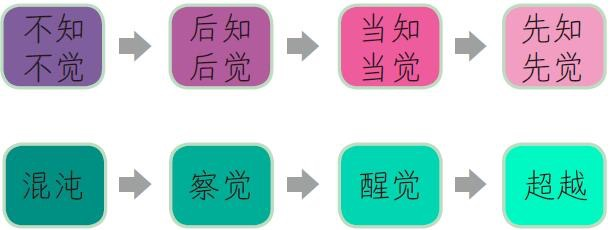
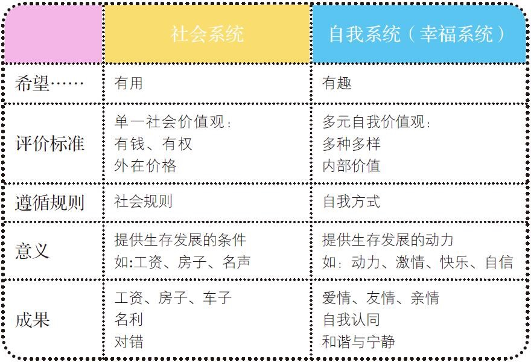
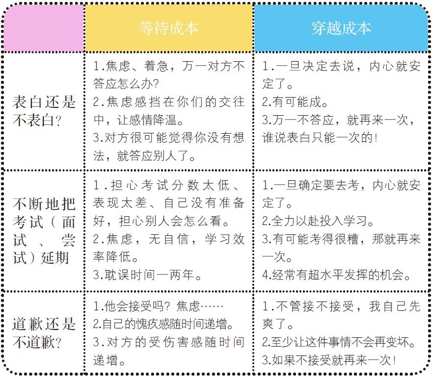
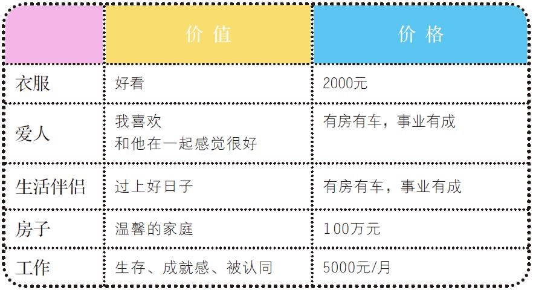

::: theorem

1. 直面恐惧，不要做安全感奴隶，让自己被需要，给出安全感。

2. 要时刻充满好奇心，对任何事情勇于尝试，太犹豫会让自己逐渐失去勇气。

3. 害怕尝试，就会对任何事情失去兴趣，一件事情在没有做之前，不要顾虑太多，连尝试都没有勇气，怎么可能成功呢。

4. 冒险-投入-成功-收获；冒险-投入-不成功-收获智慧。

5. 我的心智模式-我能成功！

6. 当认为一件事不可能完成时，多加思考，是确实不可能，还是思维的墙限制了自己，让自己不愿意付出技术努力和时间。

7. 努力错误比不努力更可怕，给自己的未来拟定一个大方向。

8. 并不是找到让自己有热情的工作才全力以赴，恰恰相反，只有全力以赴才能在工作中找到乐趣和激情。

9. 心智模式不可能一成不变，也许当初助你的心智模式，现在会阻碍你的发展。

10. 心智模式上的自我超越，需要经验

11. 成功永远是小概率事件，绝不可能人人都成功。

12. 每当你在做什么事时，必须从中好好学习，找出下次能做得更好的方法，前提是，一定要付出行动。

13. 坚持不等于成功，坚持只是成功的必要工具之一，有时候放弃也是成功的必要工具。

14. 坚持的是结果，放弃的是方式，一定看清楚坚持背后的东西。

15. 关于爱情：如果把爱与支持你的另一半作为成功的定义，你会不会比结婚更加成功？只要你每天都在关注和支持对方，每天都在构建一段更加亲密无间的信任，你就在成功的爱情当中。这个想法会不会让你更快乐？

16. 把成功的定义放在内心，很重要。

17. 成功不是高度，而是速度，行动起来，它就在自己脚下。

18. 尝试总是冒险的，而不尝试是最大的冒险。

19. 想先中大奖，再买彩票，是不可能的，花时间等一个自己最感兴趣的职业出现不太可能，一定要勇敢尝试。

20. 体会兴趣的三种境界：兴趣、乐趣和志趣。

21. 关于职业：年轻的时候应该凭着好奇尽可能多地尝试和体验一些工作，慢慢地在其中寻找到自己感到乐趣的几个，最后自己专注于投资其中一个。

22. 了解自己适合什么类型的工作，盘点自己在不同职业里的不同能力，了解目标公司的收入、待遇、发展路线图。有的人甚至在这家公司兼职先做上一两个星期，然后再开始确定。这样他们能作出最好的、未来不会后悔的选择。

23. 选择职业时，很多很适合自己的工作会显得不那么炫目，而很多听上去的“好职业”，也许恰恰是“广告”。

24. 没有完美的职业，一定要看到广告背后的真实，综合考虑。

25. 那么如何看穿职业背后的隐藏点：做一个在职人士的职业访谈；尝试一个与目标职业相关的培训，这一点很重要。；进入一些专业职业论坛或者博客群，专业论坛泡好了，是一个巨大资源；看招聘网站和公司网站。

26. 如果生命是旅途，你的眼睛就好像探照灯。你永远只能看到你所在之处的一百米处，一百米开外的地方到底怎么样你并不清楚。你能听到很多传奇和故事，但是无法做确切的计划。在你的视野范围之内，你需要精细的计划；在你听说的范围之内，你需要大方向的规划；而在那些你连听都没有听到过的地方，你需要的是相信。

27. 好的职业规划：下面是关于一个好的职业规划的几个建议：

1⃣️ 应该有一个 20 年的梦想，尽可能地大一些，尽可能抽象一点。因为你知道 20 年是很长的时间，可以发生任何事情，这个计划主要以你的梦想为主。

2⃣️ 给自己一个不超过 10 年的理想，这个计划主要以培养和发展你的核心竞争力为主。

3⃣️ 瞄准一个 5 年内能达到的目标，细分成为 3 年的职业计划。详细地了解你和这个职位的差距。这个计划以务必达成的执行为主，同时给自己一个 PLAN B。

4⃣️ 把你的规划保留下来，每隔一个月看一看，让自己保持进度。

5⃣️ 每隔半年停下来回顾你的计划。

6⃣️ 对新的机会和趋势永远保持警醒。

28. 一件事情的价值，不取决于现在你判断的价值，而取决于在未来情况中的价值，这就叫做未来价值。

29. 一份适合你的工作的未来价值远远高于你现在的专业。

30. 决定我们 10 年后成就的完全不是工作的起薪，而是工作的平台、发展机会或者是眼界——这才是一份工作对于人的未来价值，而起薪是最不需要看重的东西。

31. 不要为一个水杯约束你真正有价值的生命：专业、感情、安逸的工作......

32. 害怕损失也许会让你当下少输几个，但是很容易全盘皆输。

33. 千万不要为了一个谎言，而再说一个谎言。

34. 人对损失的感受比获得的感受强烈约 4 倍，不要害怕损失，否则会失去更多。

35. 做航行者，不要做漂泊者，两者同样精力充沛，梦想远大，适应能力强，但航行者很清楚自己想要的是什么而容易坚持，不向漂泊者那样总是在意自己不想要什么，一直在躲避而不是追寻。

36. 有一个十年的既定目标，和什么人合作，在哪里定居在哪里工作，确定之后，不要轻易动摇，不要害怕风暴。

37. IMPOSSIBLE 和 I’MPOSSIBLE 只差一点，那一点就是你心中真正的目标。

38. 做自己情感的掌控者，掌控者找到问题另外一面的同时，也找到了改变事情的可能性，从过去到现在。

39. 你愿意坚强地掌控，还是愿意自怜地受害？

40. 你没有必要得到允许才开始学习，你也没有必要得到机会才开始努力。如果你愿意，你现在就能够为这件事情做些什么，
    拒绝受害，掌控你的生命。

41. 这个世界是不公平的，你活得越久，站得越高，看得越清，你就越会意识到，世界的本质其实就是不公平。如果这个世界到处都不公平，你可以找到一个自己能够忍受不公平的方式或者能够忍受的程度，然后快乐地待下去。

42. 学会如何面对不公平，远远比学会如何评价不公平重要。

43. 不公平是我们生命中的契机，是生命提供给我们，让自己和世界变得更加美好的领导机会。

44. 试着找到自己的受害者情景、背后的思想、尽快意识到自己的情绪，确定无误后尽快摆脱它、成为自我掌控的人。

45. 活在让别人为你设计的生活中，这种生活什么都好，也许就只有一个缺点，那不是你真正热爱的生活。你可能会享受几天，然后忍受几个月或者几年，然后在最后选择放弃自己或者放弃别人。这里没有好结局。所以，坚持活出自己的世界。

46. 因为只有坚持做你喜欢的事情，你才会真正地幸福起来。而父母亲会慢慢发现，他们坚持的只是让你幸福的方式，如果你真的用自己的方式找到幸福，他们也会真正地快乐。

47. 在我们今天这个物欲横流、价值单一、家庭压过自我的世界，坚持自己的想法是一件需要勇气但是绝对值得的事情，尤其是刚刚工作那几年。

48. 你不妨把自己的梦想想象成一家上市公司的董事会，你和你的父母对于“你”这个公司都有一定的发言权。他们占有一定的股份。他们有权利发言，有权利表达观点，而你也有义务认真倾听、考虑。但记住在关于你人生的董事会上，你永远是最大的股东。

49. 如果你觉得你的生活出了问题，也许并不是因为你赚得不够多，名声不够大，而恰恰是因为你缺乏一种把物质转化为幸福的能力。幸福是一种转换力。

50. 社会的你其实不喜欢成功，你喜欢的其实是比别人成功。而自我的你其实也不喜欢成功，你喜欢的是成功的过程与希望。对幸福来说，成功就是越来越近。

51. 我们很听话地长成为一群有脑无心的人，一群有逻辑没情感的人，一群讲高度不讲尊重的人。我们长成为别人要求的样子，并且以此为荣。就这样，我们把自己弄丢了。

52. 当一个人等待与拖延的成本，远远高于他真正开始行动所需要的成本，他就会慢慢陷入越等待越不行动的怪圈。我把这个模式称为“等死模式”。一旦你陷入了等死模式，最好的选择就是行动起来！穿越过去。因为你等待的成本，远远高于你穿越的成本！

53. 如果你在一两个行业做过 10 年，那你是精英；如果你在三四个行业做过 10 年，你是精华；如果你在五六个行业做过 10 年，那你是精神病——企业讨厌不断开始的人，滚石不生苔，转行不聚财。

54. 哪个行业最好？哪个行业都好，只是看你能不能耐得下去，不去开始新的一摊。

55. 只有那种不可抑制想开始的开始，才是有结果的开始；而那种能够等几次就没有了的开始，基本上属于冲动。花费你的一部分过去，去购买一个未来，那就是一个开始的价值。

56. 如果你没有一个好的开始，不妨试试看一个坏的开始吧。因为一个坏的开始，总比没有开始强。而完美的开始，则永远都不会来到。

57. 聪明人根据价值选择合适的价格，蠢人则通过价值选择不合理的价格。最糟糕的是一群有脑无心的人，他们不知道自己要什么价值，于是他们只好按照价格来判断价值。找到属于自己的价值观，不要被价格误导了判断。

58. 有一些人不用社会意义上的成功，也能很好地走完职业的所有阶段，在普通的职位上面活出自己生命的意义。钱会让你幸福，钱也会让你失落。但是记住，工作不是用钱来算的。

59. 一旦你开始用金钱来代表成就，用价格来代表爱情，用秤来称感情，生活的幸福被你毁灭，是理所当然。

60. 想知道一个人缺什么，就看他努力秀什么。

61. 在早上刚刚醒来的时候，对自己的生命发问吧！我到底希望成为什么样子？这个世界因为我，会有什么样的改变？

62. 什么是成长？那是你内心的一个尺度。你能够感觉到你的成长，你内心知道你会成长为什么样子，就好像一棵橡树籽，无须教导，也会成长为一颗挺拔的橡树。

63. 投资幸福的三个时间段：结婚前两年；孩子 0 ～ 3 岁，14 ～ 18 岁；父母 70 岁以后。

64. 在对你重要的人 80 岁以后，每年抽出时间来陪陪他们！即使每年 5 天，也只需要花你一生不到两个月的时间，你会有一辈子的宁静。

65. 先好好地爱自己，掌控自己的生活，然后慢慢地爱更多的人。
